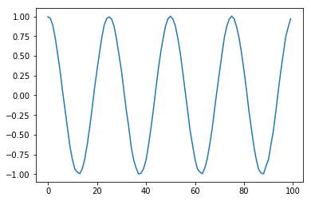

```python
%matplotlib notebook
%matplotlib inline
```


```python
# The autocorrelation function:
def r_auto(x,t):
    N=len(x)
    if (t<0) | (t>(N-1)):
        print ('Auto-correlated lag t outside allowed range')
        r_t=np.nan
    else:
        r_t=(np.dot(x[0:N-t],x[t:N]))/(N-t)
    return r_t

```


```python
a=1
N=100
f_0=np.random.randint(2,5)
print('The actual freq of the sinusoid is '+str(f_0) + ' Hz')
n_vec=np.linspace(0,1-1/N,N)
noise_vec=0.01*np.random.randn(N)

x=a*np.cos(2*np.pi*f_0*n_vec)+noise_vec

plt.plot(x)

############################################
# Estimate the rough frequency estimate ($w_1$):
############################################
num,den=0,0
l_1=0
l_2=N-3
for n in range(l_1,l_2-2):
    num+= r_auto(x,n+1)*(r_auto(x,n)+r_auto(x,n+2))
    den+=r_auto(x,n+1)**2
w_1=np.arccos(num/(2*den))
f_rough=w_1*N/(2*np.pi)
print('The rough estimate of the sinusoid is '+str(f_rough))

############################################
# Estimate the correction offset to get a finer grained estimate ($\mu$):
############################################
a_00,a_01,d_0,d_1=0,0,0,0
for n in range(l_1,l_2+1):
    a_00+=r_auto(x,n)**2
    a_01+=n*np.sin(w_1*n)*r_auto(x,n)
    d_0+=np.cos(w_1*n)*r_auto(x,n)
    d_1+=n*np.cos(w_1*n)*np.sin(w_1*n)*r_auto(x,n)
a_10=a_01
n_v=np.arange(l_1,l_2+1)
a_11=np.dot(n_v**2,(np.sin(w_1*n_v))**2)
mu_est=(d_1*a_00-d_0*a_10)/(a_11*a_00-a_01*a_10)
print('The correction to the rough estimate of the freq of the sinusoid is '+str(mu_est))
f_fine=f_rough+mu_est
print('The final estimate of the freq of the sinusoid is '+str(f_fine))
```

    The actual freq of the sinusoid is 4 Hz
    The rough estimate of the sinusoid is 4.02404623619
    The correction to the rough estimate of the freq of the sinusoid is 0.00182166469216
    The final estimate of the freq of the sinusoid is 4.02586790088
    





